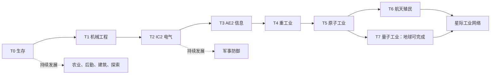

# 星铸：总体设计

## 1. 体验与边界

玩家从一处能自给自足的聚落起步，逐步建设供电、采矿、物资调度、防线与殖民据点。长期目标是让系统持续运转：停电时能保住氧气和炮塔，运输中断时前线有库存，扩建时旧工厂仍能供货。

默认面向单人及 2–8 人合作，难度取向为中等工程挑战。本文全部配方数量、波次参数和效率数值均为**首轮平衡目标**，不冒充模组默认值或实测结果。`SF-xx` 是设计编号；文中的部件名是设计用语，不是已经确认的注册 ID。

采用以下层次（V2 引导架构，实现见 `design/progression.json`）：

- **材料与机器能力**承担主要进度：做得出上游组件，才有下游设备。
- **ProgressiveStages** 是**唯一的进度记录层**（纯软锁模型）：8 个时代阶段（T0–T7）+ 22 个能力节点（永不反向授予时代）在同一张依赖图上；记录团队的工业成果、驱动里程碑奖励与图谱导航，但**不锁任何物品、配方、机器、维度或界面**。内容门槛完全由配方材料、能源需求、机器链与生存环境承担——允许提前探索或"偷跑"，代价是真实成本而非禁止。
- **Progression Map**（PS 库存按钮打开）是**总导航**：时代主线 + 能力分支 + 各节点达成条件一览（图谱上显示的是里程碑凭证与依赖关系，不是权限闸门）。
- **FTB Quests** 提供并列教程、路线说明与可选里程碑；`milestones` 章用 `gamestage` 任务与 PS 图谱实时同步——任务书记录进度但不授予进度；关闭任务系统仍应能从 T0 完成地球 T7。
- **Advancements** 是成就记录层：时代镜像（`stage_granted`，仅在 PS 实际授阶后由桥接颁发）、原版触发与自定义事件成就，均不授予阶段。
- **手册**（任务书 manual 章）是详细知识库，分组自由翻阅。
- **运行时提示**（`starforge_guidance.js`）是场景层：真实游戏事件 → PS 自定义计数器 / 一次性本地化提示 / 成就颁发，不做二次授权。

不加入另一套完整科技体系，不加入随机词条装备、魔法技能树或强制 Boss 材料。生存基础、食物、普通建筑和交易不按职业锁定。

## 2. 模组职责与持久价值

| 模组 | 主要职责 | 输入与输出联动 | 后期仍有用的原因 |
| --- | --- | --- | --- |
| IC2CRE | 电力、矿物精炼、电路、核能、铱、纳米及量子技术 | 为 IE、AE2、炮塔与航天供应电路、储能和高级合金 | 高级材料、供能与设备升级始终经过 IC2 |
| BuildCraft CE | 采石场、泵、引擎、组装台等特色设备；普通管道降级为遗产适配（配方需 FastPipes 管芯） | 采石/泵送/引擎发电，输出经 FastPipes 进 IE 原料缓冲仓与 IC2 处理线 | 不再承担日常物流管网职责，保留标志性工业设备 |
| Railcraft Reborn | 行星内重型铁路物流：货运/罐车、装卸机、蒸汽机车与电力机车、信号、隧道掘进、焦化与蒸汽锅炉 | 矿区→铁路货运→工业基地→星港；钢、杂酚油、蒸汽与统一石油经济互认 | 跨基地大宗实体运输始终是铁路的职责，不被管道或 AE2 取代 |
| 沉浸工程（IE） | 焦化、钢、金属冲压、批量冶炼、重型机器、生物燃料 | 接 IC2 电路与精炼材料；供应机械组件、弹药、结构件 | 大批量耗材与重工业效率优势 |
| Immersive Petroleum | 油田勘探、开采与精炼的石油化工业 | 接 BC 泵送与运输、IC2 电气控制；输出燃料与化工品到发电、防务与航天 | 统一石油经济的主干加工，与 IE 共用重工业风格 |
| 应用能源 2（AE2） | 中后期仓储、库存控制、自动合成与远端补给 | 接实体缓冲仓；调用 IC2 与 IE 生产设备 | 管理复杂度；不凭空产生原料或能源 |
| Storage Drawers | 大宗单品种实体仓储与仓库控制 | 接农场、矿场与产线散料；经仓储控制器向 AE2 开放库存 | 高密度散料始终比数字单元便宜 |
| Sophisticated Storage | 通用容器升级、过滤与缓冲仓储 | 接产线缓冲与基地库房；高级升级消耗 IC2/IE 组件 | 灵活仓储与厂区外观统一 |
| Sophisticated Backpacks | 随身仓储与远征物资包 | 采矿、工程、探索、航天与殖民施工用途；高级升级分阶段开放 | 只承担随身容量，不替代工业物流 |
| Ad Astra | 航行、氧气、行星、空间站与殖民环境 | 火箭依赖 IC2/IE/AE2；矿产回流地球 | 资源效率、基地扩张与跨星球分工 |
| Ad Astra: Giselle Addon | 航天自动化与便利层：自动 NASA 工作台、燃料装载机、重力稳定器、火箭传感器、氧气罐 | 接 AE2/工业接口做发射场自动化；不绕过氧气/燃料/火箭等级 | 发射场与殖民地的自动化补强，不改动航天递进 |
| Ad Astra: Asteroid Belt | 小行星带高风险采矿维度（T6.2+ 区间） | 高密度原版矿藏小行星；无氧、低重力、可能误降损失火箭 | 稀有矿资源动机，不取代地球矿山经济 |
| More Structures / Simple Structures: Ad Astra | 遗迹与可选高危探索（两个结构模组共存） | 输出材料包、加工捷径、蓝图与特殊模块 | 提供探索目标，不参与基础科技必需品闭环 |
| The Hordes / Zombies Break & Build / In Control! | 波次、攻城 AI、刷怪生态 | 消耗防御、维修与农业产能 | 让扩张产生可预见的后勤需求 |
| IE 哨戒炮 + TACZ Turrets | 自动防线（T2 工业固定 → T4 军用自动） | TACZ 炮塔消耗装入枪械对应的实弹，从脚下弹药箱取弹；IE 炮塔消耗 IE 弹药 | 多种火力配合，而非一种炮塔通吃 |
| TaCZ Addon | 枪匠台 QoL：附件/弹药过滤、材料清单、JEI 跳转、邻近容器取料 | 只降操作负担 | 不改配方成本、不解锁科技 |
| TaCZ Pack Upgrader | 旧格式枪包 → 1.21.1 移植版格式转换 | 启动时自动处理 tacz/ 目录 | 不授予第三方枪包再分发权 |
| EOS – Dawn Goddess Lab（TaCZ 枪包） | 中后期重型/科幻武器层（ARR，经 CF CDN 分发不入库） | 武器经工业中间件分 T3–T5 材料层级；弹药成本显著高于常规枪械 | 虫群/Boss/怪潮/外星远征，不取代常规枪械 |
| Easy Villagers | 抽象化殖民设施：农业、人口、贸易、基础材料 | 接食物与材料产线；运输村民支持殖民 | 设施化居民取代大量自由活动实体，压低常驻 AI 开销 |
| Guard Villagers | 殖民警卫、民兵与驻军 | 消耗军工产线的武器、护甲与弹药库存 | 建筑内部与炮塔死角的第二层防御 |
| TaCZ（非官方 NeoForge 移植） | 单兵枪械与弹药 | 武器制造接入 IC2/IE/石油/AE2；弹药进入工业经济 | 军事消费端，不是独立枪战科技树 |
| Guard Villagers TACZ Support | 守卫使用 TaCZ 武器的桥接 | 守卫索敌、射击、耗弹、找弹药/食物、射界调整 | 原生机制优先，行为逐项实测 |
| 农夫乐事 / 懒人厨房 | 烹饪、厨房储备与基地食堂 | 农产供餐、供 IE 生物燃料；工业回馈设施 | 矿区、前线和殖民据点持续需要补给 |
| FramedBlocks / Supplementaries / Macaw's Furniture / Refurbished（+Framework / Energized Furniture） | 外观、结构造型、标识、实用设施与家具陈设（生活/装饰层）；Refurbished 另承担现代厨房与智能家居 | 消耗统一建筑材料（木材、铁、玻璃等）；家具层不建立独立科技树；家电经 Energized Furniture 变压器接 FE 电网 | 基地、工业设施、空间站与殖民地的生活区与装饰，不以摆家具计分 |
| Building Gadgets 2 | 批量施工 | IC2 电池、电路、IE 材料、后期 AE2 部件 | 建筑师承担大型工厂与殖民扩建 |
| Enderman Overhaul / Mutant Monsters / Creature Feature | 定向敌对生态候选 | 进入维度白名单、遗迹或异常事件池 | 补战术角色，禁止所有生物全维度随机混刷 |
| Arachnids | 虫群/区域威胁 | 主世界仅限沙漠与恶地；经生物群系标签扩展到金星、水星、霜原星；月球与火星禁用 | 提供大规模战斗与基地防御压力，不替代异常生物定位 |

Polymorph、Controlling、Mouse Tweaks、Crafting Tweaks、AppleSkin、Jade Addons 属体验辅助层，性能模组属运维层：均不进入科技树、不产生新路线，职责与装载侧见[兼容性核查](compatibility.md)与[性能层](performance.md)。不加入 Iron Chests、Tom's Simple Storage 或其他与 AE2 定位重复的大型数字仓储。不引入 MineColonies、MCA Reborn、TACZ NPCs 或大型 RPG NPC 系统；殖民人口与驻军体系见[殖民人口与驻军](colonies.md)，战斗数值验收见[战斗基准](combat-benchmark.md)。

### 物流层级（实体 → 网络 → 星际）

```text
基地内部短距离    FastPipes 管网（物品/流体/FE 一网，默认方案）
      ↓
基地·矿区·星港之间  Railcraft 货运铁路（货运车/罐车 + 装卸站 + 信号）
      ↓
大型自动化网络    AE2（数字库存 + 自动合成 + 远端补给）
      ↓
跨星球           Ad Astra 火箭（人员/火箭货运 → 外星殖民地铁路网）
```

Railcraft 只承担**行星内部**的重型实体物流，不取代基地内部管道、不复制 AE2 的数字调度、不承担跨星球运输；Ad Astra 火箭是唯一星际运输层。典型链路：矿区 → 货运铁路 → 工业基地 → AE2/BC 分拣 → 星港 → 火箭 → 外星殖民地；外星殖民地同样用铁路连接登陆区、前哨、矿场、氧气区、工业区与发射场。Railcraft 强制区块加载仅有 WorldSpike 系列方块（`world_spike` 配方已升至 T4 材料：钢部件+高级电路，`personal_world_spike` 保留平价——只在玩家在线时加载），默认不提供长距离铁路永久强加载——列车沿途按矿车常规规则加载；星港装卸区建议用 Personal World Spike 做受控点加载。

## 3. 科技树：共同底座与可选分支



阶段授予以**服务端确认的制造/运行成果**为准，不以捡到物品、登录天数、击杀 Boss、提交任务或进入维度为准。每个时代的晋级凭证只要求前一时代的材料链（`design/tech-tiers.json` 记录全部内容的预期可负担时代，校验器强制一致），阶段本身不授予权限——凭证物品的配方就是通往下一时代的真实成本。"偷跑"成立：提前凑齐材料即可提前制造，但材料、能源与机器链保证你无法零成本跳过完整时代。

| 等级与内部 ID | 上游条件与晋级证据 | 该时代的典型能力（由材料链自然解锁） | 基地新需求 |
| --- | --- | --- | --- |
| T0 `survival_age` | 新团队自动获得 | 原版、农夫乐事基础厨房、普通造型建筑 | 储粮、照明、围栏、维修道路 |
| T1 `mechanical_age` | T0 手工制成工程装配件 | FastPipes 基础物品/流体/能量管与基础附件；BC 引擎/泵；IE 焦炉、基础高炉、手工工程材料与传送带 | 燃料、木材、钢铁、物流缓冲 |
| T2 `electric_age` | T1 制成首台 IC2 基础发电机与基础电路 | IC2 LV，随后以 LV 产线制 MV 组件；双倍矿物处理目标；IE 哨戒炮与 TaCZ 枪匠台 | 电网、稳定铜锡供应、弹药 |
| T3 `information_age` | T2 电气产线制造信息接口组件 | AE2 压印、基础 ME 网络、控制器、基础自动合成、库存补给；EOS 高斯枪族（工程处理器门槛） | 稳定供电、石英与硅、分区布线 |
| T4 `heavy_industry_age` | T3 批量制造重工业控制组件 | IE 电弧炉、斗轮采矿等大型设备；BC 采石场；TACZ 自动炮塔；EOS 重型高斯/特种枪械；大规模自动合成 | 大宗电力、矿场、钢材、轮班补给 |
| T5 `atomic_age` | T4 生产屏蔽材料并完成反应堆控制组件的台架测试 | IC2 核电、铀处理、UU 起步、铱与纳米；先进材料生产；EOS ELP 电浆系与特种武器（屏蔽材料+奇点/异常分析门槛） | 冷却与备用电、反应堆维护、产线隔离 |
| T6 `space_age` | T5 地球工厂制成航天控制核心 | 基础火箭、空间站、氧气设施；独立殖民子树 | 燃料、密封、氧气、返航保障、远端库存 |
| T7 `quantum_age` | T5 用地球可得材料制成量子控制组件 | 量子装备、大型计算、量子桥、高吞吐工厂 | 大规模持续供能、跨区协调、冗余系统 |

T3 的“信息时代”属于中期：T2 要先完成稳定电力与实体物流循环。T4 之前 IE 的轻型金属冲压、挤压/发酵和基础电气设备可以逐步开放，不把整套 IE 到 T4 才放出。T5 是制造能力阶段，核电是该阶段的主力方案，但不强制每名玩家操作核反应堆。

航天子树：T6.0 地球轨道与月球；T6.1 火星；T6.2 金星/水星；T6.3 霜原星（Glacio）与小行星带。默认保留火箭等级带来的航线差异，但每一级航天材料都提供地球合成途径；先去外星采矿可显著节省成本。编号不等于实际 Ad Astra 火箭目的地表，绑定时以锁定版本核实。

小行星带（`pv_asteroid_belt:asteroid_belt` / `_orbit`，JAR 实测）定位为 **T6 中后期的高风险采矿区**：无氧、地表 0.5g / 轨道 0g、-50℃/-170℃、自然刷怪原生关闭；小行星由 jigsaw 结构生成，矿物为原版铜/铁/金/青金石/红石/钻石/绿宝石 + Ad Astra 铁构件。保留该 Mod 原生的「可能误降小行星、可能损失火箭」风险，不做安全化处理；资源密度高但单次行程运力与风险受限，避免"挖一次就淘汰地球矿山"。

### 团队制造与个人专精

同团队共享时代里程碑记录，新成员加入即同步，不必重做凭证物品。制造完全开放：阶段只证明团队已经能造，不限制任何设备；机器归属以放置者/基地登记记录确定，仅用于补给、维护与威胁统计。

跨队可以出售成品；任何人都能直接使用买到的量子装备——阶段里程碑只按"亲手制成凭证物品"认定，拾取或购买不授予。设备能力与威胁按实际部署等级计入，避免低阶段团队购买高级工厂后获得永久新手保护。服务端不设制造拦截：物品、配方、机器与维度一律不被阶段锁定。

个人职业不使用排他锁。单人可以横向发展；多人通过交易减少重复劳动。默认合作规则不设计 PvP 军备竞争。

## 4. 配方联动与冷启动

以下数量为设计目标。所有原物品必须先导出注册表、配方和标签再绑定；不猜测 `ic2:`、`ic2cre:` 等命名空间。优先改现有物品配方，自定义中间件限于具有多个用途的 8 类：工程装配件、信息接口组件、重工业控制组件、反应堆控制组件、航天控制核心、殖民维护组件、量子控制组件、异常分析模块。

| 编号 | 开放制造 | 配方目标（单次产出 1，注明者除外） | 用途与防循环要求 |
| --- | --- | --- | --- |
| SF-01 | T0 | 工程装配件 = 铁锭×4 + 铜锭×2 + 红石×2 + 活塞×1 | T1 凭证；完全手工，无钢材或机器前置 |
| SF-02 | T1 | FastPipes 基础管道：沿用原生铁+玻璃配方；抽取附件 = 铁+活塞，不要求 IC2 电路 | 农场和矿区直接用统一管网；BC 管由 SF-35 降级为需 FP 管芯的遗产外壳 |
| SF-03 | T1 | IC2 发电机 = 原发电部件 + IE 铁机械部件×1；基础电路维持铜线/橡胶/红石冷启动 | 发电机、手工线材、电池不能依赖发电机自身产物 |
| SF-04 | T2 | IE 电气控制件 = 铜线圈×2 + IC2 基础电路×1；原低压供电设施保留起步配方 | IC2 电气能力进入 IE 批量设备；T1 机械设施不受此限制 |
| SF-05 | T2 | 信息接口组件 = IC2 高级电路×1 + IE 电子部件×2 + 石英玻璃×2 | T3 凭证；不使用 AE2 处理器、压印机或 ME 网络 |
| SF-06 | T3 | AE2 压印机 = IC2 基础电路×2 + IE 铁机械部件×2 + 活塞×2 + 铁锭×3 | 有压印机才能生产首批处理器 |
| SF-07 | T3 | 三类处理器压印模板 = 对应普通矿物 + IE 钢板×2 + IC2 基础电路×1 | 各模板有确定性地球配方；陨石探索仅省材料；石英/硅/福鲁伊克斯亦有地球途径 |
| SF-08 | T3 | AE2 控制器 = 工程处理器×2 + IC2 高级电路×2 + IE 电子部件×2 + 原 AE2 外壳材料×3 | 压印机先由独立电源供电，制作控制器不需要已有控制器 |
| SF-09 | T3 | 样板供应器/自动合成单元 = 各自 AE2 处理器 + IC2 电路 + IE 铁机械部件 | T3 小规模自动合成；T4 才扩展高容量 CPU 与密集网络 |
| SF-10 | T2 | 基础机枪塔 = IE 钢板×6 + 铁机械部件×2 + IC2 基础电路×2 + 电池×1 | 不要求 AE2；T2 前依靠地形、手动武器及原版防御 |
| SF-11 | T3 | 重工业控制组件 = IC2 高级电路×2 + AE2 逻辑处理器×2 + IE 钢机械部件×2 | T4 凭证；钢部件可由已开放轻型设备加工 |
| SF-12 | T4 | BC 采石场 = 原矿机结构 + IC2 高级电路×2 + IE 钢机械部件×4 | BC 负责挖掘，IC2 负责精炼；早期不开放廉价全自动大矿场 |
| SF-13 | T4 | IE 重型工程块 = 钢机械部件×2 + IC2 高级合金×2 + 高级电路×1，产量按原配方校准 | 门槛落在重型核心/成形验证，不能依靠提前囤钢绕过 |
| SF-14 | T4 | 榴弹塔 = IC2 高级合金×4 + AE2 工程处理器×2 + IE 钢机械部件×4 + 基础塔底座×1 | AoE 与弹药经济；护甲生物另有破甲方案 |
| SF-15 | T4 | 反应堆控制组件 = IC2 高级电路×4 + IE 钢机械部件×2 + 铅屏蔽板×8 | T5 凭证；不能使用铱、UU、核燃料或反应堆产物 |
| SF-16 | T5 | 激光塔 = IC2 储能组件 + 高级合金×4 + AE2 工程处理器×2 + IE 电子部件×4 | 依靠电力、留冷却空隙，不能全面取代实弹防线 |
| SF-17 | T5 | 航天控制核心 = IC2 高级电路×4 + AE2 工程处理器×4 + IE 钢机械部件×4 + 航天合金×4 | T6 凭证；航天合金地球配方先开放，不要求火箭制造台 |
| SF-18 | T6 | 火箭发动机 = 对应级 Ad Astra 材料 + IC2 电动组件×2 + IE 重型机械部件×2 | 用真实发动机配方替换；高级火箭也保留电气与重工业链 |
| SF-19 | T6 | 火箭导航/控制部件 = 航天控制核心 + 对应级机体材料 | 基础运载不消耗铱或量子控制组件，防止首航成本过高 |
| SF-20 | T6 | 氧气设备 = 原氧气功能部件 + IC2 电路×2 + IE 流体工程部件×2 | 保留原氧气规则；工业组件嵌入生产，不重写一套独立氧气系统 |
| SF-21 | T6 | 空间站建设物资 = 原站点材料 + IC2 电力组件 + IE 结构件 + AE2 物流组件 | 修改真实站点建造成本；不能只有火箭改配方、空间站仍原版低价 |
| SF-22 | T6 | 殖民维护组件 = 橡胶×4 + IE 钢板×4 + IC2 基础电路×1 | 维修任务/补给箱材料；仅在实际维修适配完成后作为消耗品启用 |
| SF-23 | T5 | 量子控制组件 = IC2 铱强化材料×4 + 高级电路×4 + AE2 工程处理器×4 + IE 高级结构件×2 | T7 凭证；UU 样本、铱强化材料和结构件均须在 T5 地球制造 |
| SF-24 | T7 | 量子装备 = 对应 IC2 纳米装备 + 原量子材料 + 量子控制组件 | 能量、机动性和生存能力升级，仍需基地后勤 |
| SF-25 | T7 | AE2 量子桥 = 原 AE2 部件 + IC2 铱强化材料 + IE 钢结构件 | 地球远端基地也可使用；量子缠绕奇点完全地球可得 |
| SF-26 | T2 | 基础建造工具 = IC2 电池×1 + 基础电路×2 + IE 铁机械部件×2 | 批量铺设，照常消耗建筑材料与电力 |
| SF-27 | T4 / T5 | 替换工具加入高级合金；复制粘贴工具加入 AE2 处理器与大容量电池 | 按独立工具配方分阶；若单工具模式无法用配方分级，不伪造模式权限 |
| SF-28 | T5 | 异常分析模块 = IC2 高级电路×2 + AE2 计算处理器×2 + 高纯材料×4 | 地球实验生产；探索奖励同类模块或特殊外观版，不垄断功能 |
| SF-29 | T2 | 高级仓储升级 = 对应模组升级基底 + IC2 基础电路×1 + IE 铁机械部件×1 | 容量、过滤、压缩类升级按级开放；不靠钻石直达终局容量 |
| SF-30 | T2–T4 | 背包高级升级 = 背包升级基底 + IC2 电路 + IE 部件，按级递增 | 容量、拾取与补给功能分阶段；不提供随身合成网络或无限加工 |
| SF-31 | T2 | TaCZ 武器：原配方关键件替换为 IC2 精炼金属件 + IE 冲压零件，按武器梯级递增 | 枪械制造接入工业链；不用木头 + 铁锭直接得到终局步枪 |
| SF-32 | T2 | TaCZ 标准弹药：铜/铅/钢弹头弹壳 + 火药或化工发射药，成组产出 | 弹药进入工业经济；发射药可接石油化工副产 |
| SF-33 | T4 | TaCZ 特种弹药：高级合金 + 石化材料 + IE 加工件 + IC2 电力组件 | 穿甲/高威力弹面向装甲目标，成本明显高于普通弹 |

### 地球自给资源表

| 资源 | 地球确定性生产方式（待绑定配方） | 外星/探索优势 | 护栏 |
| --- | --- | --- | --- |
| 铁、铜、锡、铅、铝、镍、铀 | 配置主世界矿层；BC 采矿 → IC2 精炼 → IE 成形 | 外星高密度矿脉/更少废石 | 缺失矿物采用数据包配置地球矿层；不把主世界原有矿层全部关闭 |
| 钢、橡胶、硅、电路 | 铁与焦炭、橡胶种植、沙/石英加工 | 副产物减耗和集中供货 | T1 基础高炉与橡胶来源不可锁在 T2 后 |
| AE2 石英、模板、福鲁伊克斯 | 地球矿产与上述确定性模板配方 | 遗迹直接回收模板和存储材料 | AE2 入门不依赖陨石位置或遗迹掉落 |
| 铱及 UU 初始样本 | T5 地球富集矿物的确定性高成本精炼得首份铱，再走 IC2 扫描/复制链 | 稀有矿脉、遗迹材料包减少电耗与原矿消耗 | 不能“先有铱才能复制铱”而不给首份铱；不依赖废料彩票 |
| 戴斯、耐热航天材料、霜原合金等对应 Ad Astra 材料 | T5/T6 用地球金属和高纯碳按级合成；成本计入 IC2 精炼与 IE 加工 | 月球、金星/水星、霜原星直接采掘/富集 | 每种实际注册材料在航线审计中逐一列出地球配方；不假定各级材料可以互相替代 |
| 火药与弹药原料 | 原版硝化物来源保留，并增加地球矿物/木炭的可再生工业配方 | 火星大量铁铜与化工副产物 | 不把刷怪塔或探索当成弹药生产唯一来源；避免怪潮掉落覆盖全部军费 |
| 火箭燃料 | 地球油田经 BC 开采/运输进入统一石油链：IP 精炼 → IC2/IE 精制工序 → Ad Astra 认可燃料 | 外星原料富集、集中燃料基地 | 首航燃料全部地球可产，不依赖外星产物、不构成循环；统一流体标签见石油经济一节，不猜 fluid ID |
| 食物、氧气、水 | 地球种植养殖、厨房、Ad Astra 氧气设备；每个殖民地带启动水与供电 | 火星温室、月球储水/温室、霜原星冰水 | 植物不能在未供氧密闭舱中被设定为无限免费氧气来源 |

目标：同一高级材料，地球路线的总原料成本为外星成熟产线的 1.5–2 倍，能耗约 2–3 倍。对极少量可选特种模块可放宽，但不能把地球路线调成几十倍的惩罚。对比须包含运输、燃料、氧气、防御与返航成本，不能只比较工作台配方。

矿石处理不做跨模组无限翻倍：原矿/粗矿/粉末/锭/板分清标签；精炼副产物设单向链；回收后总金属量不超过投入。统一输出到一种标准锭，保留必要原生材料；禁用重复矿层前先检查矿种和生成高度。已实现（2026-09-23）：Almost Unified 按 `IE > IC2CRE > Ad Astra > Railcraft` 优先级统一输出（末影粉→AE2），KubeJS 负责输入侧 `c:` 标签放宽与 AU 改不动的序列化器覆盖；矿层去重经数据包 biome_modifier 空表可逆禁用，明细见 implementation-status.md 同日期节。

### 能源与工业核心

保留 IC2 电压、储能与布线的决策价值；BC 燃料物流和 IE 生物柴油是早期与分布式供能方案，核能解决后期规模问题。IC2 的核心定位由高级组件与精炼链保证，不必强制所有路灯也走 EU。

**FE 公共电网（2026-09-24 实测定稿，2026-10-16 Ad Astra 前哨电源恢复并网）**：`主力发电 = IE / IC2CRE / BuildCraft；Ad Astra 燃煤发电机与太阳能板 = 行星前哨/外星本地电源`，全部经原生 FE 接口并入同一电网。`ad_astra:coal_generator`/`solar_panel` 已恢复配方与获取面——captest 实测两者全六面+any 暴露 `Capabilities.EnergyStorage.BLOCK`，不做任何转换桥；燃煤发电机（燃料槽=槽位 1，`coalGeneratorEnergyGenerationPerTick=20` FE/t）→ FastPipes 能量管+抽取附件 → Ad Astra 压缩机实测 200 tick 窗口入账 3920 FE（≈20 FE/t 连续，源/管网/目的端守恒）；太阳能板 → 能量管实测三条链路入账：主世界→IC2 电炉 1200 FE、月球→AA 压缩机 1848 FE（白天窗口 24 FE/t）、地球轨道→AE2 控制器（32 FE/t 档）；`dayTime%24000>12000` 入夜即停、`canSeeSky` 遮挡判定原生保留，各星球 solar_power 差异不动（地球 16/月球 24/火星 12/金星 8/水星 64/轨道 32）。月球维度经 captest 确认与主世界共享同一 dayTime 计数器、isDay 边界逐维度一致——「月球太阳能不发电」系面板被埋于无天空可见位置所致，非逻辑缺陷，未做兼容修复。仍禁用：Refurbished 明/暗发电机、AE2 振动室（删配方、隐藏 EMI/JEI 与创造栏，物品保留注册以兼容存档）；AA 机器、AE2 网络与家电各自经原生接口从电网吃电。FastPipes 能量管是默认 FE 干线（basic 1k → improved 4k → advanced 8k → elite 16k → ultimate 32k FE/t，混网按单管瓶颈限速），凡暴露 `Capabilities.EnergyStorage.BLOCK` 的设备即插即用，能量抽取附件可主动从可抽取缓存取电。已实测的接口面：IE 电容全六面、接线器按朝向；Ad Astra energizer/机器全六面（etrionic_capacitor 不暴露 FE）；IC2CRE batbox/发电机/电缆全六面暴露 FE——原生 FE 桥确认存在，不需要另做转换器；AE2 能量接收器/控制器全六面收 FE（能量直接进 ME 网，孤立接收器无网络时不蓄电）；Energized Furniture 能源变压器全六面收 FE 后转 Refurbished Watt（原配方以被禁发电机为原料，已由 FE 电网部件重写配方，见 implementation-status）；BuildCraft 经 `powerMode=DISPLAY_FE`（`pack/config/buildcraftcore-common.toml`，`mjPerFe=0.1` 即 1 MJ = 10 FE，2026-09-24 运行时 captest 实测）原生并网：引擎经 MjPort→FeEndpoint 向相邻 FE 存储（含 FastPipes 能量管）直接推电，机器经 MjReceiverEnergyStorage 暴露收电 cap 直接吃 FE，玩家侧统一显示 FE；mj_dynamo 与 engine_fe 保留为可选显式互转设备，不承担并网职责；Railcraft 的 charge_terminal/charge_motor 不暴露 FE capability——Charge 网络保持独立自足，但经 `starforge_compat:charge_bridge`（FE↔Charge 双向转换器，2026-10-14 captest 实测）并入公共电网：方块实现 Railcraft 官方 `ChargeBlock` 节点 API（ConnectType.BLOCK、零损耗、RECHARGEABLE 4096 网络电池，电池由 Railcraft 自身创建并经 ChargeSavedData 持久化，无模拟存储），FE 侧暴露标准 EnergyStorage；256 FE/t 上限、4096 FE 缓冲、严格 1 FE = 1 Charge（实测转换比 1.0、往返 4096→4096 无损、每 tick 单向杜绝自激回路，两台桥互连只搬运不增殖）；潜行右击循环 AUTO/FE→Charge/Charge→FE/关闭，红石信号强制禁用；配方 SF-37、阶段锁 electric_age（电力铁路起点），无 Railcraft 时整个特性自动缺席。

EU / mEU / FE / MJ / AE 的兼容只使用确认过的接口。IC2CRE Dev-0.4 公共能源接口使用 mEU，1000 mEU = 1 EU；不把这个换算当作 FE 或 MJ 比例。本版已实测：IC2CRE 方块实体经其内置 FE 端口暴露 NeoForge EnergyStorage（4 FE = 1 EU 换算由模组自身承担），batbox/发电机/电缆均可被 FastPipes 能量管读写——FE↔mEU 桥不再是必需项；BC 侧为上游原生对称换算：DISPLAY_FE autoconvert 在引擎/机器/动力管边界按 `microMjPerFe` 自动互转，mj_dynamo/engine_fe 为保留的单向显式转换块。任何可逆转换回路的输出不得大于输入，不新增无限免费供电通道；FE→Refurbished Watt、FE↔MJ、IC2 原生 FE 端口均为单向受控或上游原生换算，禁止构成循环发电。守恒抽查（captest）：Ad Astra energizer 经能量管向 IC2 电炉送电，源端净失 ≥ 目的端净增+管网缓存，无增殖。[IC2CRE 镜像（上游 2026-09-26 停用，MIT）](https://github.com/RabiMew/RabiMew-Starforge/releases/tag/vendor-deps)

**发电/耗电审计（2026-10-13）**：IE 柴油发电机 4096 FE/t 维持上游值（T5 主力，生物柴油产线即成本）；IC2 核电 `nuclearOutputScale = 1.0`（数百至数千 EU/t，按 4 FE/EU 折算为 T5 规模电源，铀料与散热是真实约束）；BC `powerMode=DISPLAY_FE` + `mjPerFe = 0.1`（1 MJ = 10 FE）下 autoconvert、engine_fe 与 mj_dynamo 以同一 `microMjPerFe` 换算——FE→MJ→FE 往返无损但零净增，不构成复制；dynamo 基础 4 MJ/t = 40 FE/t，齿轮升级可提升。Ad Astra 机器分档 100/150/250/500 FE/t 输入上限（iron/steel/desh/ostrum）；etrionic 高炉每件耗能 10 → 500 FE（原值按 AA 自家电网 20 FE/t 经济标定，接入 FE 电网后近乎免费，见 `pack/config/ad_astra.jsonc`）；水泵 20 FE/t 出 50 mB/t 维持。Ad Astra 发电侧（2026-10-16 恢复）：燃煤发电机 20 FE/t 烧煤稳定供网、太阳能板按星球 solar_power 0–64 档日间发电，均为原生 FE 源经 FastPipes 入网——定位为前哨/外星本地电源，不取代工业主力发电。AE2 能量接收器按 0.5 比率收 FE（2 FE = 1 AE），`usageMultiplier = 1.0`；晶振发电机 20 AE/t 且每网络仅一台生效（EnergyOverlayGrid 抑制其余），作自举余量保留；振动室禁用。Refurbished `fuelToPowerRatio = 16`，家电 Watt 仅经 Energized 变压器单向馈入（FE 容量 1M、1k FE/t 收发上限、每节点 1 FE/t），无回流 FE 路径。

### 统一石油经济

油田 → BuildCraft 泵送开采、FastPipes 流体管运输 → Immersive Petroleum 精炼与化工 → IC2 电气控制与精密组件 → IE 重工业加工 → 燃料与化工产品 → 发电、军事耗材与 Ad Astra 航天燃料。

BC CE 与 Immersive Petroleum 同时提供原油、燃料或炼油设备时，先导出两者的流体、流体标签与配方再绑定：同种流体共用注册条目或互认标签，重复配方按工序定位保留其一，目标是**一条石油经济**而非两套互不相干的产油系统。优先使用现有标签、capability 与配方实现互通；必须桥接时才用 KubeJS / 数据包，且在实际安装并导出注册表之前不猜 `immersivepetroleum:`、`buildcraft:` 等命名空间下的 fluid ID。

首枚火箭燃料是冷启动检查项：全部原料与设备可在地球制造，不依赖外星产物、不消耗火箭自身产物、不构成循环依赖。

### 仓储与随身装备成长

| 阶段 | 仓储主力 | 规则 |
| --- | --- | --- |
| T0 | 原版箱子、木桶 | 手工整理 |
| T1 | Storage Drawers 与 Sophisticated Storage 基础形态 | 承担大宗矿物、金属锭、工业零件、农产品与工厂缓冲库存 |
| T2 | 容量、过滤、压缩与工业仓储升级 | 高级升级适量消耗 IC2 电路、IE 工程组件与已开放阶段材料；不靠钻石直达终局容量 |
| T3 | AE2 成为实体仓库之上的数字化层 | 实体产线 → 抽屉/通用仓储 → 各自仓储控制器 → AE2 存储总线与网络 → 自动合成与库存管理；AE2 不让实体仓库失去价值 |
| T7 | AE2 量子桥承担远距离工业网络 | 两端供电与加载要求不变 |

两套实体仓储由各自的控制器汇总，不假定一个控制器能统一管理两套系统；AE2 通过存储总线读取汇总后的库存。Sophisticated Backpacks 承担采矿背包、工程师工具包、探索补给、航天远征物资与殖民施工包；基础背包较早开放，容量、压缩、自动拾取、自动补给等升级随 T2–T4 分阶段开放。背包不是便携 AE2：不提供无限自动加工，不绕过工业物流与材料阶梯。

## 5. 七条长期路线

| 路线 | 持续交付 | 依赖别人什么 | 高级目标 |
| --- | --- | --- | --- |
| 工业工程 | 电路、合金、核电、标准组件 | 矿场原料、后勤、工厂扩建 | 双电网与稳定高纯材料生产 |
| 自动化与物流 | 分拣、实体仓储层级、库存阈值、生产订单、弹药补给 | 工业机器与电力、前线需求 | 故障可定位、缺料有预警的跨基地系统 |
| 军事防御 | 防线、射界、火力配置、驻军与维修规范 | 弹药、电池、食物与建筑 | 用有限预算守住多方向袭击 |
| 航天殖民 | 火箭、氧气网、居住区与驻军、返航补给、外星矿产 | 地球工业、货物、温室与建筑 | 两个以上能自治的殖民据点 |
| 探索 | 地图、遗迹回收、材料包、特殊模块 | 装备、食物、燃料、回收容量 | 用探索为工业节约成本并发现特殊目标 |
| 农业与后勤 | 食堂、种子、植物油、远征补给箱 | 农具、仓储、照明、温室 | 地球和外星的稳定补给网络 |
| 建筑 | 车间、防线、管廊、发射场、空间站 | 建筑材料、施工工具、规划需求 | 标准化且美观的可扩建工业设施 |

需求靠产物互换形成，不规定“必须由某职业玩家制作”。没有建筑完成度扫描或强制装修任务；建筑价值来自通行、密封、射界、防火分区、检修和视觉表达。

殖民居民可在工作站领取工业岗位，为所属基地提供克制且边际递减的增益；无人产线始终以 100% 基础能力运行，岗位放大效率而非创造能力，不构成工业前置。岗位、维护与后勤规则见[殖民岗位与维护](colony-workforce.md)。

## 6. 农业、厨房与施工

食品链为四级路线（2026-09-24 定稿）：`Farmer's Delight 手工烹饪 → Refurbished + Cooking for Blockheads 现代厨房 → IE + Engineers Delight 中型工业加工 → Immersive Cooking & Farming 大规模自动化 → AE2 仓储 → 殖民地/空间站后勤`。层级分工：FD 做手工与小规模；Engineers Delight 用原生 IE 机器配方（园艺玻璃罩/冲压机/挤压机/发酵机/搅拌/装瓶/锯木，钢制屠宰刀为门槛）做中规模工业加工；Immersive Cooking & Farming 的烹饪锅/发酵罐/食品处理机/烤炉多方块只做吞吐与自动化提升，不无成本提高产率；重复工艺按此归属，不双写配方。

T0：农夫乐事种植、切菜板、烹饪锅；懒人厨房集中存料和按需做饭。两套烹饪界面不自动等于完全互通：先测试切菜/锅具配方与厨房食谱识别，不能宣称厨房已自动执行所有农夫乐事配方。

T1：FastPipes 管网、IE 传送带连接收成仓与厨房缓冲。T2：Refurbished 现代厨房（工作台制作家具，抽屉/冰箱/橱柜原生进 CFB 厨房网络，水槽/家电作连接器）；灌溉/照明/供电由已验证设备承担；地球温室先作为结构化农场，不虚构温控机制。电气厨房入口为 `starforge_compat:electric_burner`（FE 供电、断电即停热，见 implementation-status 末节）；Refurbished 炉灶原生计入 FD 热源。T2–T3：Engineers Delight 的 IE×FD 原生配方承担中型食品加工。T3：AE2 补原料、碗和燃料到厨房/烹饪锅，成品分类回收；机器侧烹饪仍由原设备执行。T3–T4：Immersive Cooking & Farming 多方块接管大批量自动化产线（beta 版，重点验收稳定性/性能/dedicated server）。T4：IE 生物燃料与食物共享种植体系，用库存阈值先保食堂，剩余农产再制燃料。

T6：月球温室重在密封与储水，火星温室重在产能与防线。断电先切生产，再限非必要设备，保氧气、基础照明与安全返航库存。各基地的氧气、电池与食物按**20 分钟实测耗用**准备缓冲，作为补给建议，不增加永久饥饿惩罚。

食物不硬锁科技，不添加无必要腐败倒计时；高级餐食利用既有饱食/增益机制，提高持续工作与远征舒适度。机械修理由实际维修适配支持，尚未实现时维护组件不假装自动扣除。

建筑材料 T0 起开放。工业外观围绕混凝土、钢架、玻璃、管廊、警示标识统一；装饰方块不因外观自动获得防爆或气密属性。FramedBlocks 伪装材质的硬度、爆炸抗性与氧气密封逐项测试。Building Gadgets 的铺设/替换/复制粘贴/破坏按 T2/T4/T5 材料分级（基础电路→高级电路/合金→AE2 处理器+蓝波顿水晶，见 SF-26/27/39）；禁止复制带库存/能源/实体数据的机器来增殖资源。

## 7. 可选里程碑

任务书全部章节同时可见（启程 + 七章路线 + 时代里程碑 + 参考手册），每章内用树状 `deps` 表达建议顺序（flexible：进度自由、完成按序）。跨路线只链接教程页，不产生完成依赖；不设置必须完成的“主线总章”。

`milestones` 章用 `gamestage` 任务镜像 T1–T7 时代阶段（团队持阶即自动完成），`star_map` 指引玩家打开 ProgressiveStages 进度图谱。支线任务一律 `optional: true`（不计章节完成度）；required 任务不得依赖 optional 任务（校验器强制）。

检测任务不消耗机器；说明类任务允许阅读确认；能力节点通过 PS 触发条件与运行时事件（`design/guidance.json`）识别，不经任务书授予。默认奖励为少量食物、原材料或里程碑奖励包（右键打开的随机奖励容器，奖池按时代分层，见 design/reward-pools.json），不发超出该时代材料层级的机器、电路与唯一蓝图，不发放尚未到达星球的深空材料（tier_6 不含金星/霜原材料），不以领取奖励授予阶段。

终局展示的是运营能力：工厂有备用电，防线能补给，远端库存有阈值，殖民地能在断供时坚持一段时间。地球 T7 也有等价长期目标：多区域工业、灾后恢复与高效城市后勤，不要求去太空才能“通关”。

### 隐藏彩蛋（不入任务书、不授阶段）

玩家首次亲手击杀另一名真实玩家时，获得被害者头颅的特殊可食用版本（显示真实皮肤，名称为“[玩家名]的头颅”）与隐藏成就「……这真的能吃？」。头颅 tooltip 仅以彩色乱码暗示“食用效果”；真正效果是无限时长的生命恢复 VI 与凋零 VI（普通状态效果，牛奶/死亡/命令可清除）。纯彩蛋：不授予科技阶段、不进 ProgressiveStages/FTB Quests 依赖、每名玩家只触发一次；普通玩家头不受影响。
